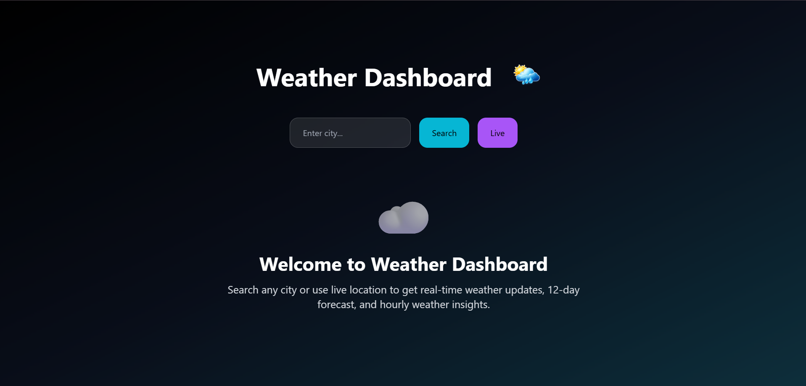
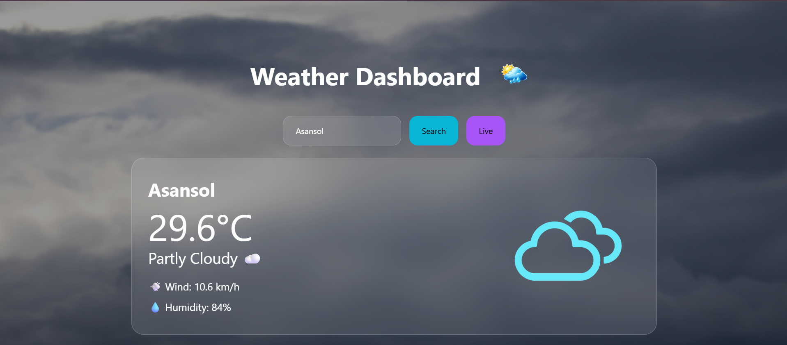
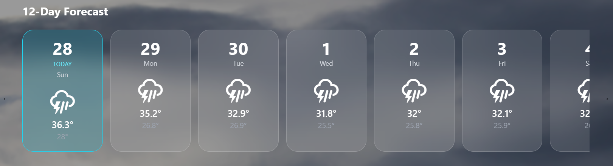
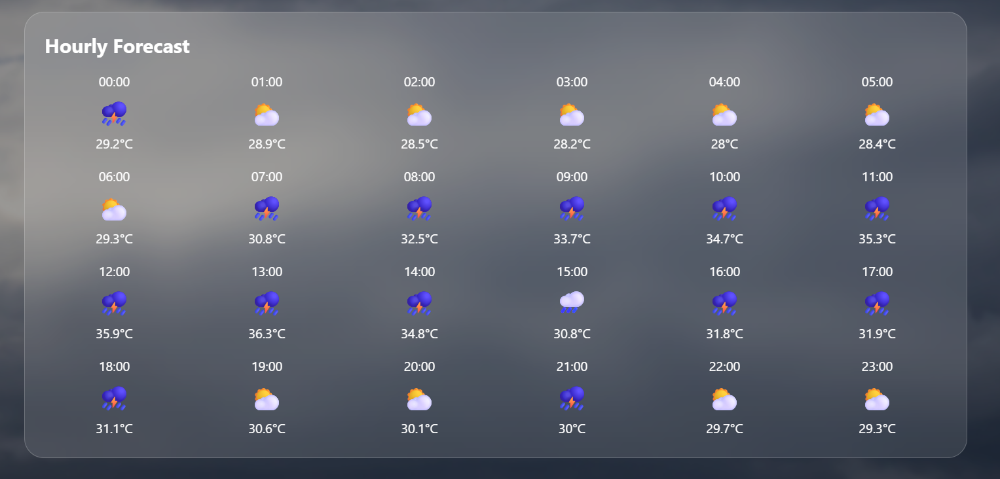

# Weather Dashboard

## Project Description
Weather Dashboard is a responsive web application built with React.js and Tailwind CSS that provides real-time weather information for any location. Users can search by city name, view a 12-day forecast, and check hourly weather updates. The app includes location-based weather detection via the browser geolocation API, dynamic weather condition icons, and adaptive background images based on current weather conditions. Key features include smooth UI transitions, responsive design, and a horizontal forecast navigation slider.

## Technology Stack
- **Frontend Framework**: React.js (v19.2.7)
- **Styling**: Tailwind CSS (v3.4.17)
- **API Client**: Axios (v1.18.1)
- **Weather API**: Open-Meteo API
- **Deployment**: Vercel

## Main Features
1. City-based weather search with autocomplete
2. Real-time location detection using geolocation API
3. 12-day weather forecast with graphical representation
4. Hourly weather panel with date selector
5. Dynamic background images based on weather conditions
6. Weather condition icons (sunny, rainy, snowy, etc.)
7. Responsive layout for desktop and mobile devices
8. Loading states during API requests
9. Smooth weather state transitions

## Project Structure
```
weather-dashboard/
├── public/              # Static assets (favicon, manifest)
├── src/                 #
│   ├── components/      # Reusable UI elements
│   │   ├── Header.jsx
│   │   ├── WeatherCard.jsx
│   │   ├── ForecastSlider.jsx
│   │   └── HourlyPanel.jsx
│   ├── pages/           # Main application pages
│   │   ├── Home.jsx
│   │   └── Forecast.jsx
│   ├── utils/           # API and utility functions
│   │   ├── api.js
│   │   └── helpers.js
│   ├── hooks/           # Custom hooks
│   │   └── useWeatherData.js
│   ├── services/        # API services
│   │   └── weatherAPI.js
│   ├── utils/           # Data utilities
│   │   ├── weatherFormatting.js
│   │   └── dataHelpers.js
│   ├── pages/           # Page components
│   │   └── IndexPage.jsx
│   ├── App.jsx
│   ├── main.jsx
│   └── styles.css
├── .env
├── package.json
├── README.md
├── tailwind.config.js
└── vite.config.js
```

## Usage
1. Visit [live demo](https://weather-dashboard-eosin-delta.vercel.app/)
2. Enter a city name or allow location access
3. View real-time weather metrics and forecasts
4. Select specific days from the 12-day forecast
5. Check hourly weather details using the navigation slider

## API Reference
The application utilizes the Open-Meteo API for weather data. Key endpoints include:
- `https://api.open-meteo.com/v1/forecast?latitude={lat}&longitude={lon}&current_weather=true`
- `https://api.open-meteo.com/v1/forecast?latitude={lat}&longitude={lon}&hourly=temperature_2m,precipitation_probability`
- Authentication: No API key required for basic usage

## Installation
```bash
# Clone repository
git clone https://github.com/harshshubham987-svg/weather-dashboard

# Install dependencies
cd weather-dashboard
npm install # or yarn install

# Run development server
npm run dev # or yarn dev

# Build for production
npm run build
```

## Live Demo
[https://weather-dashboard-eosin-delta.vercel.app/](https://weather-dashboard-eosin-delta.vercel.app/)

## Repository
[https://github.com/harshshubham987-svg/weather-dashboard](https://github.com/harshshubham987-svg/weather-dashboard)

## Author
Harsh Singh
GitHub: [github.com/harshshubham987-svg](https://github.com/harshshubham987-svg)

## License
MIT License - Use, modify, and distribute freely with proper attribution.

## Screenshots

### Home Page

<br />

### Weather Search

<br />

### Forecast Section

<br />

### Hourly Forecast


## Future Improvements
- Add weather trend visualizations (D3.js)
- Implement weather alerts notification system
- Add map viewpoint for multiple locations
- Include air quality and UV index data
- Implement search history persistence
- Add location-based timezone conversion
- Integrate with smart home weather sensors
- Create mobile PWA support
- Add dark/light theme toggle
- Implement weather summary infographics